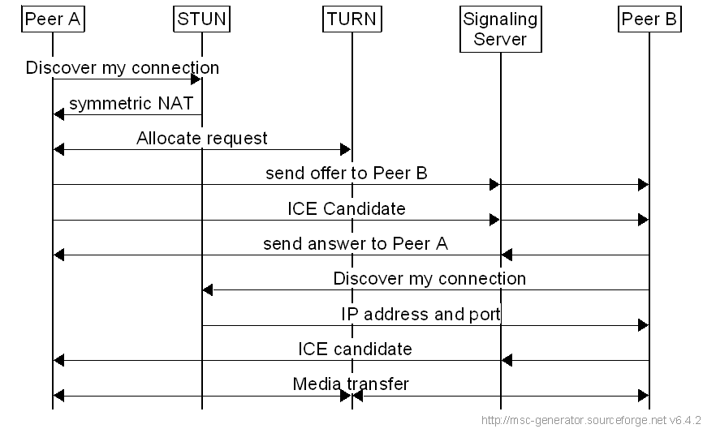

# WebRTC Essentials

## Core Concept

### 1. Peer-to-Peer (P2P)

- Direct communication between two devices without requiring a central server for data transfer.
- WebRTC facilitates this via APIs.

### 2. ICE (Interactive Connectivity Establishment)

- A framework for NAT traversal that finds the best possible path for communication between peers.
- Combines STUN, TURN, and candidate prioritization.

### 3. NAT (Network Address Translation)

- A technique used by routers to map multiple private IP addresses to a single public IP.
- WebRTC uses STUN and TURN to overcome challenges posed by NAT.

### 4. STUN (Session Traversal Utilities for NAT)

- A protocol that helps a device discover its public IP and port.
- Used for NAT traversal when direct communication is possible.

### 5. TURN (Traversal Using Relays around NAT)

- A relay protocol for cases where direct peer-to-peer communication is blocked by NAT or firewalls.

## Media Components

### 1. MediaStream

- Represents a stream of audio and/or video tracks.
- Created from local media devices (camera, microphone) or received from a remote peer.

### 2. RTCPeerConnection

- The primary API for managing peer-to-peer connections in WebRTC.
- Handles SDP negotiation, ICE candidates, and media/data streaming.

### 3. RTCDataChannel

- Enables peer-to-peer communication for arbitrary data (e.g., text, files, or binary data).
- Operates over the same connection as audio/video streams.

### 4. Tracks

- Individual components of a media stream, such as an audio or video track.
- Can be dynamically added or removed from a MediaStream.